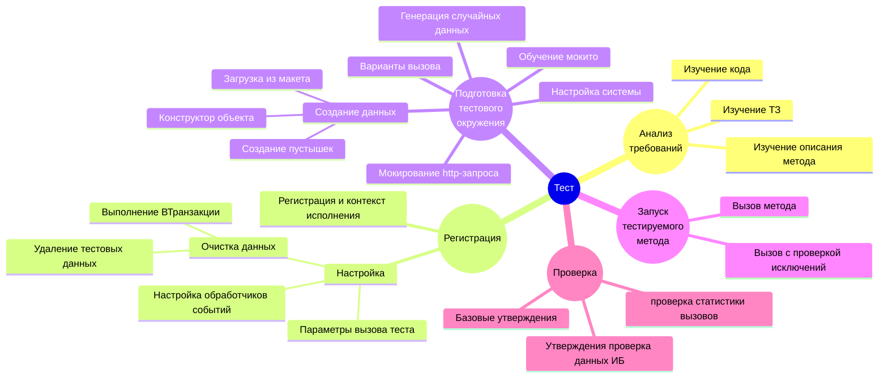

# Шпаргалка

:::tip
Перед разработкой теста следует изучить требования к тестируемому методу/функциональности.
На которые будет опираться ваш тест, он должен проверить соответствие между требованиями к функциональности и реализацией.
:::



Тест состоит из двух обязательных частей, которые также можно разбить на блоки:

## Регистрация

:::info Ссылки
[Описание](./user-api/test-registration.md), [API](/api/ЮТТесты)
:::

Для регистрации тестов используется обязательный предопределенный метод `ИсполняемыеСценарии`

```bsl
Процедура ИсполняемыеСценарии() Экспорт
    
    ЮТТесты.Добавить...

КонецПроцедуры
```

Он должен располагаться в каждом общем модуле с тестами, в нем перечисляются все доступные тесты модуля.
Метод `ИсполняемыеСценарии` вызывается при загрузке тестов движком, задолго до исполнения.

За регистрацию и настройку выполнения тестов отвечает модуль [`ЮТТесты`](/api/ЮТТесты), он позволяет:

* Зарегистрировать тесты, с возможностью выбрать контексты исполнения:
  * [`ДобавитьТест`](/api/ЮТТесты#добавитьтест) - Тест выполняется во всех контекстах тестового модуля
  * [`ДобавитьКлиентскийТест`](/api/ЮТТесты#добавитьклиентскийтест) - Тест выполняется на клиенте
  * [`ДобавитьСерверныйТест`](/api/ЮТТесты#добавитьсерверныйтест) - Тест выполняется на сервере
* Настроить параметры исполнения теста:
  * [Очистка данных](user-api/test-data/test-data-deletion)
    * Выполнение [`ВТранзакции`](/api/ЮТТесты#втранзакции) - Тест выполняется в транзакции
    * Удаление тестовых данных ([`УдалениеТестовыхДанных`](/api/ЮТТесты#удалениетестовыхданных)) - Данные созданные тестом будут удалены (если они создаются с помощью API движка - [`ЮТест.Данные()`](/api/ЮТест#данные)) вне зависимости от транзакции
  * [`СПараметрами`](/api/ЮТТесты#спараметрами) - Тестовый метод будет вызван с указанными параметрами
  * Настройка обработчиков событий
    * [`Перед`](/api/ЮТТесты#перед) - Указывает, какой метод будет выполнятся перед тестом
    * [`После`](/api/ЮТТесты#после) - Указывает, какой метод будет выполнятся после тестом
* [`ДобавитьТестовыйНабор`](/api/ЮТТесты#добавитьтестовыйнабор) позволяет сгруппировать тесты в наборы

## Реализация

:::info Ссылки
[Описание](./user-api/), [API](/api/ЮТест)
:::

### Подготовка тестового окружения

:::info Ссылки
[Описание](user-api/test-data/), [API](/api/ЮТТестовыеДанные)
:::

* Настройка системы - для корректной работы теста часто необходимо выполнить настройку системы - установить нужные константы, заполнить учетную политику, выполнить настройку подключения и так далее.
* Создание [тестовых данных](./user-api/test-data/), в большинстве тестов понадобятся данные из базы, для создания которых вам поможет:
  * Конструктор объекта [`ЮТест.Данные().КонструкторОбъекта`](/api/ЮТТестовыеДанные#конструкторобъекта), с помощью которого вы можете создать объект с необходимыми реквизитами.
  * Создание пустышек - примитивных объектов, без заполнения реквизитов.
    * [`ЮТест.Данные().СоздатьЭлемент`](/api/ЮТТестовыеДанные#создатьэлемент)
    * [`ЮТест.Данные().СоздатьДокумент`](/api/ЮТТестовыеДанные#создатьдокумент)
    * [`ЮТест.Данные().СоздатьГруппу`](/api/ЮТТестовыеДанные#создатьгруппу)
  * Возможна загрузка из макета. Вы можете создать все необходимые данные [загрузив их из макета](user-api/test-data/#загрузка-данных-из-макетов)
* Генерация случайных данных. При необходимости вы можете использовать методы генераторы случайных значений

<details><summary>

Методы-генераторы

</summary>

* [`ЮТест.Данные().СлучайноеЧисло`](/api/ЮТТестовыеДанные#случайноечисло)
* [`ЮТест.Данные().СлучайноеПоложительноеЧисло`](/api/ЮТТестовыеДанные#случайноеположительноечисло)
* [`ЮТест.Данные().СлучайноеОтрицательноеЧисло`](/api/ЮТТестовыеДанные#случайноеотрицательноечисло)
* [`ЮТест.Данные().СлучайнаяСтрока`](/api/ЮТТестовыеДанные#случайнаястрока)
* [`ЮТест.Данные().СлучайныйИдентификатор`](/api/ЮТТестовыеДанные#случайныйидентификатор)
* [`ЮТест.Данные().СлучайнаяДата`](/api/ЮТТестовыеДанные#случайнаядата)
* [`ЮТест.Данные().СлучайныйIPАдрес`](/api/ЮТТестовыеДанные#случайныйipадрес)
* [`ЮТест.Данные().СлучайноеЗначениеИзСписка`](/api/ЮТТестовыеДанные#случайноезначениеизсписка)
* [`ЮТест.Данные().СлучайноеБулево`](/api/ЮТТестовыеДанные#случайноебулево)
* [`ЮТест.Данные().СлучайноеЗначениеПеречисления`](/api/ЮТТестовыеДанные#случайноезначениеперечисления)
* И другие

</details>

* Настройка мокито, для изоляции теста и подмены результатов работы методов вам может пригодится [`Мокито`](user-api/mockito.md). С помощью него вы можете настроить/изменить поведение нужных методов конфигурации
  * [`Вернуть`](/api/МокитоОбучение#вернуть) нужный результат для определенных параметров.
  * [`ВыброситьИсключение`](/api/МокитоОбучение#выброситьисключение) при в нужный момент.
  * [`Пропустить`](/api/МокитоОбучение#пропустить) метод (не выполнять).
  * Просто [`Наблюдать`](/api/МокитоОбучение#наблюдать) (собирать статистику вызовов) за методом.
  * За настройку условий срабатывания тех или иных действий отвечает метода [`Когда`](/api/МокитоОбучение#когда)
* Варианты вызова. Чтобы повысить покрытие метода тестом можно сформировать наборы (варианты) параметров вызова метода. Для упрощения работы с ними вы можете воспользоваться методом [`ЮТест.Варианты()`](/api/ЮТест#варианты)
* Мокирование http-запроса, для тестирования http-сервисов конфигурации добавлен объект реализующий интерфейс `HTTPСервисЗапрос`. [`ЮТест.HTTPСервисЗапрос()`](/api/ЮТест#httpсервисзапрос) позволяет настроить и эмулировать входящий запрос.
 Если логика обработки запросов вынесена в отдельный общий модуль, то вы с легкостью с его помощью сможете протестировать ваш сервис без использования веб-сервера.

### Вызов тестируемого метода

Тут все просто, необходимо вызвать тестируемый метод с нужными подготовленными параметрами. А потом проверить результат его работы.

В некоторых случаях необходимо проверить, что метод выбрасывает, либо наоборот не выбрасывает исключений. Для этого следует воспользоваться вызовом метода с [использованием движка](user-api/assertions/assertions-base#проверка-методов-объекта).

### Проверка ожиданий

:::info Ссылки
[Описание](user-api/assertions/)
:::

* Проверка результат функции. Для проверки переменных (результат функции) реализованы [базовые утверждения](user-api/assertions/assertions-base), подробнее со списком возможностей можете ознакомиться в [сгенерированном описании api](/api/ЮТУтверждения).
* Если метод должен изменить данны в информационной базе, то эти изменения можно проверить с помощью [утверждений ИБ](user-api/assertions/assertions-db), [описании api утверждений](/api/ЮТУтвержденияИБ).
* В некоторых случаях необходимо проанализировать какие методы и с какими параметрами вызывались. Здесь вам поможет [проверка статистики вызовов](/api/МокитоПроверки#вызовы), который собирает [Мокито](user-api/mockito)

## Примеры

При возникновении трудностей с написанием тестов вы всегда можете

* Посмотреть примеры [тестов движка](https://github.com/bia-technologies/yaxunit/tree/develop/tests/src/CommonModules)
* Тесты других открытых проектов
  * [bellerage-ssl](https://github.com/Bellerage-IT/bellerage-ssl/tree/master/src/cfe/yaxunit/src/CommonModules)
* 