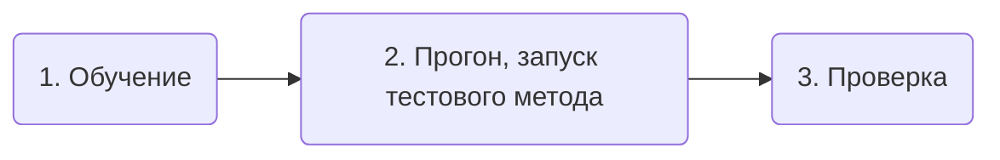
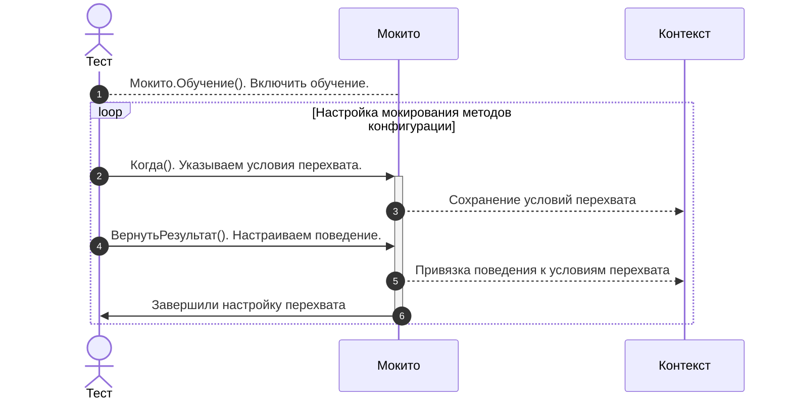
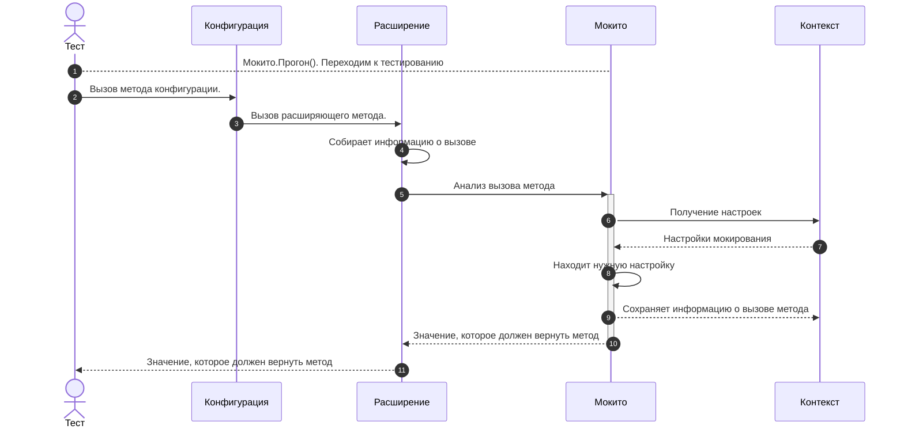

# Мокито

[Мокито](/api/Мокито) - модуль созданный по образу популярного java-фреймворка для тестирования [Mockito](https://site.mockito.org/). Расширяет возможности тестирования, позволяет легко менять логику работы системы подменяя результаты работы методов, отключая какие-либо алгоритмы и проверки.

## Возможности

С помощью Мокито мы можем с легкостью управлять поведением системы прямо из теста, для этого есть возможность:

* Настраивать какие методы "меняют" свое поведение, а какие обрабатывают "как положено".
* Для разных тестов или кейсов внутри теста можно перенастраивать поведение методов.
* Задавать условия на параметры метода.
* Мокировать как экспортные так и приватные методы, процедуры и функции.
* Настраивать разные "реакции" на вызов метода:
  * Вернуть указанный результат
  * Вызвать исключение
  * Не выполнять метода
  * Просто наблюдать за методом (собирать статистику по вызовам)

Вы можете мокировать почти любой метод конфигурации, **исключение** - методы глобального контекста.

1. Методы общих модулей
2. Методы менеджеров
3. Методы конкретных объектов, будь то документы или справочники

Примеры:

* Для всех объектов определенного типа - обучаете через менеджер

  ```bsl
  Мокито.Обучение(Документы.ПриходТовара) // Для всех документов ПриходТовара
    .Когда("ОбработкаПроведения")
  ```

* Если нужно мокировать метод экземпляра объекта, то указываем его при обучении

  ```bsl
  Мокито.Обучение(ДокументОбъект) // Для конкретного экземпляра объекта, 
    .Когда("ОбработкаПроведения") // другой документ объект, даже полученный из той же ссылки отработает без мокирования
  ```

* либо ссылку на этот объект

  ```bsl
  Мокито.Обучение(ДокументСсылка) // Любой документ объект с той же ссылкой
    .Когда("ОбработкаПроведения")
  ```

* Можно мокировать методы обработок и отчетов

  ```bsl
  Мокито.Обучение(Отчеты.ОСВ) // Для всех отчетов
    .Когда("СформироватьОтчет")
  
  Отчет = Отчеты.ОСВ.СоздатьОтчет();
  Мокито.Обучение(Отчет) // для конкретного экземпляра отчета
    .Когда("СформироватьОтчет")
  ```

Мокито не может:

* Выполнять произвольную логику при вызове - выполнить алгоритм или вызвать какой-либо другой метод.
* Не может изменять параметры.
* При сборе статистики не хранит результат.

## Принцип работы

Мокито базируется на двух вещах:

* Расширения и заимствование методов, благодаря им появилась возможность менять поведение системы.
* Глобальный контекст, доступный как из теста, так и из заимствованных методов конфигурации.

### Настройка мокируемых методов

Для того чтобы вы смогли мокировать метода, вам в первую очередь необходимо добавить его в свое расширение.

И добавить реализацию по шаблону для функции:

```bsl
&Вместо("<ИмяМокируемогоМетода>")
Функция Мок_<ИмяМокируемогоМетода>(<ПараметрыМетода>)
  ПараметрыМетода = Мокито.МассивПараметров(<ПараметрыМетода>);
  ПрерватьВыполнение = Ложь;

  Результат = МокитоСлужебный.АнализВызова(<МокируемыйОбъект>, "<ИмяМокируемогоМетода>", ПараметрыМетода, ПрерватьВыполнение);

  Если Не ПрерватьВыполнение Тогда
    Возврат ПродолжитьВызов(<ПараметрыМетода>);
  Иначе
    Возврат Результат;
  КонецЕсли;
КонецФункции
```

Либо для процедуры:

```bsl
&Вместо("<ИмяМокируемогоМетода>")
Процедура Мок_<ИмяМокируемогоМетода>(<ПараметрыМетода>)
  ПараметрыМетода = Мокито.МассивПараметров(<ПараметрыМетода>);
  ПрерватьВыполнение = Ложь;

  МокитоСлужебный.АнализВызова(<МокируемыйОбъект>, "<ИмяМокируемогоМетода>", ПараметрыМетода, ПрерватьВыполнение);

  Если Не ПрерватьВыполнение Тогда
    ПродолжитьВызов(<ПараметрыМетода>);
  КонецЕсли;
КонецПроцедуры
```

Примеры добавления методов в расширение.

#### Метод общего модуля

Добавляем обработку метода `ПолучитьПрофиль` общего модуля `РаботаСПочтой`

```bsl
&Вместо("ПолучитьПрофиль")
Функция Мок_ПолучитьПрофиль(ИмяОтправителя, ИспользоватьIMAP) Экспорт
    // Собираем параметры в массив
    ПараметрыМетода = Мокито.МассивПараметров(ИмяОтправителя, ИспользоватьIMAP);

    // Отправляем данные на анализ
    ПрерватьВыполнение = Ложь;
    Результат = Мокито.АнализВызова(РаботаСПочтой, "ПолучитьПрофиль", ПараметрыМетода, ПрерватьВыполнение);

    // Обрабатываем результат анализа
    Если НЕ ПрерватьВыполнение Тогда
        Возврат ПродолжитьВызов(ИмяОтправителя, ИспользоватьIMAP);
    Иначе
        Возврат Результат;
    КонецЕсли;
КонецФункции
```

#### Метод модуля менеджера

Добавляем обработку метода `НовыйИдентификаторПодписчикаУведомлений` модуля менеджера справочника `Справочники.МобильныеУстройства`

```bsl
&Вместо("НовыйИдентификаторПодписчикаУведомлений")
Процедура Мок_НовыйИдентификаторПодписчикаУведомлений(Подписчик, Идентификатор) Экспорт

    // Собираем параметры в массив
    ПараметрыМетода = Мокито.МассивПараметров(Подписчик, Идентификатор);

    // Отправляем данные на анализ
    ПрерватьВыполнение = Ложь;
    Мокито.АнализВызова(Справочники.МобильныеУстройства, "НовыйИдентификаторПодписчикаУведомлений", ПараметрыМетода, ПрерватьВыполнение);

    // Обрабатываем результат анализа
    Если НЕ ПрерватьВыполнение Тогда
        ПродолжитьВызов(Подписчик, Идентификатор);
    КонецЕсли;

КонецПроцедуры
```

#### Метод модуля объекта

Добавляем обработку приватного метода `ОбработкаПроведения` модуля объекта справочника `Документ.ПриходТовара`

```bsl
&Вместо("ОбработкаПроведения")
Процедура Мок_ОбработкаПроведения(Отказ, Режим)

    // Собираем параметры в массив
    ПараметрыМетода = Мокито.МассивПараметров(Отказ, Режим);

    // Отправляем данные на анализ
    ПрерватьВыполнение = Ложь;
    Мокито.АнализВызова(ЭтотОбъект, "ОбработкаПроведения", ПараметрыМетода, ПрерватьВыполнение);

    // Обрабатываем результат анализа
    Если НЕ ПрерватьВыполнение Тогда
        ПродолжитьВызов(Отказ, Режим);
    КонецЕсли;

КонецПроцедуры
```

После этого, вы может управлять поведение метода из ваших тестов.

Тестирование с использованием Мокито можно разделить на 3 стадии:



1. Сначала вы проводите **обучение** - настраиваете, какие методы мокируем и как они должны себя вести.
2. Потом выполняете тестовый **прогон** целевого метода.
3. После вам может понадобиться **проверка** вызовов, были ли вызваны нужные метода, с какими параметрами.

```bsl
  // Подготовка
  Ответ = Новый HTTPСервисОтвет(1);
  Ответ.УстановитьТелоИзСтроки(СериализацияJSON.ЗначениеВСтроку(Новый Структура("id, status",
                                                "9999",
                                                "delivered")));
  
  // Обучение мокито
  Мокито.Обучение(ОтправкаСМС_Провайдер1)
    .Когда("УстановитьСоединение").Вернуть(Истина)
    .Когда("ПослатьСообщение").Вернуть(Ответ)
    .Прогон();
  
  // Тестовый прогон
  РоботОтправки.ОтправкаСМС();

  // Проверка статистики
  Мокито.Проверить(ОтправкаСМС_Провайдер1)
    .КоличествоВызовов("ПослатьСообщение")
    .Равно(1);
```

Подробнее расскажу по каждой стадии

### Обучение

Обучение - это процесс настройки мокито. Вы указываете какие методы и при каких условиях (параметрах) должны вести себя тем или иным образом.

С помощью API вы можете:

* [`Наблюдать()`](/api/МокитоОбучение#наблюдать) - просто наблюдать за методом, собирать статистику.
* [`Когда()`](/api/МокитоОбучение#когда) - указать какой метод и с каким параметрами необходимо обрабатывать.
* [`Вернуть()`](/api/МокитоОбучение#вернуть) - настроить, чтобы метод возвращал нужный результат.
* [`ВыброситьИсключение()`](/api/МокитоОбучение#выброситьисключение) - настроить, чтобы метод выбрасывал исключение.
* [`Пропустить()`](/api/МокитоОбучение#пропустить) - настроить, чтобы метод был пропущен, не выполнился.
* [`ВыполнитьМетод()`](/api/МокитоОбучение#выполнитьметод) - настроить, чтобы метод выполнился как есть.

```bsl
Мокито.Обучение(ОтправкаСМС_Провайдер1)
    .Когда("УстановитьСоединение").Пропустить()
    .Когда("ПослатьСообщение").Вернуть(Ответ)
    .Наблюдать("ОбработатьОтвет")
```

Подробнее о методах ниже, а сейчас для лучшего понимания расскажу как работает обучение:



В процессе обучения мы создаем правила, описывающие как будет вести себя метод при различных вариантах вызова.
Правила состоят из двух частей

* условие срабатывания (об/ект, метод, параметры), задаются в методе `Когда` или `Наблюдать`
* действие выполняемое при соблюдении условий - `Вернуть`, `ВыброситьИсключение`, `Пропустить`, `ВыполнитьМетод`

#### Условия

Условие состоит из трех частей

* Объект, которому относится метод
* Имя метода
* Параметры метода

##### Объект

Объект является обязательным и задается в методе `Мокито.Обучение()`.

В качестве объекта могут выступать:

* **Менеджер объекта метаданных**, в таком случае под условие попадают все обращения к этому типу метаданных, будь вызовы методов модуля менеджера или объекта.
* **Ссылка**, под условие попадают все обращения к объектам имеющим ту же ссылку.
* **Объект** - конкретный объект метаданных (документ, обработка, набор записей), только обращения к методам этого экземпляра объекта.

##### Имя метода

Регистронезависимое имя метода, является обязательным. Указывается в методах `Когда` или `Наблюдать` b Можно обрабатывать и экспортные и приватные метода, главное чтобы для него была [выполнена настройка](#настройка-мокируемых-методов)

##### Параметры

Указывается в методах `Когда` или `Наблюдать`, передачей массива ожидаемых параметров.

Необязательная часть условия, если не указывать, но будут обрабатывать все вызовы.  
Также необязательно указывать все параметры метода, достаточно указать только первую часть.

В качестве параметров можно указывать:

* Конкретные значения параметров
* Маски
  * [`Мокито.ЛюбойПараметр()`](/api/Мокито#любойпараметр) - параметр может принимать любое значение
  * [`Мокито.СтроковыйПараметр()`](/api/Мокито#строковыйпараметр) - параметр может принимать только строковые значения
  * [`Мокито.ЧисловойПараметр()`](/api/Мокито#числовойпараметр) - параметр может принимать только числовые значения
  * [`Мокито.ТипизированныйПараметр()`](/api/Мокито#типизированныйпараметр) - параметр может принимать значения указанного типа
* Предикаты, параметр должен соответствовать заданным условиям.

##### Варианты обучения

Существует 2 основных подхода к формированию условий вызова:

1. Явный вызов метода с параметрами

   ```bsl
   Мокито.Обучение(РаботаСHTTP)
    .Когда(РаботаСHTTP.ОтправитьОбъектНаСервер(ИсточникДанных, Данные))
    .Вернуть(2)
   ```

2. Указание имени метода и набора параметров

   ```bsl
   Мокито.Обучение(РаботаСHTTP)
    .Когда("ОтправитьОбъектНаСервер", Мокито.МассивПараметров(ИсточникДанных, Данные))
    .Вернуть(2)
   ```

Первый вариант имеет ряд недостатков:

1. Работает только для экспортных методов
2. Необходимо передавать все обязательные параметры или использовать для них маску `Мокито.ЛюбойПараметр()`
3. Если не указывать необязательные параметры, то их значения по умолчанию попадут в настройку. Покажу на примере.

   ```bsl
   // Имеется метод 
   Функция Метод(Параметр1, Параметр2, Параметр3 = 3) Экспорт
    Возврат Параметр1 + Параметр2 + Параметр3;
   КонецФункции

   Мокито.Обучение(...)
    .Когда(Метод(1, 2))
    .Вернуть(0)
    .Прогон();
   
   Метод(1, 2);    // Вернет 0
   Метод(1, 2, 3); // Вернут 0
   Метод(1, 2, 4); // Вернут 7, будет выполнен основной алгоритм

   // Второй вариант обучения
   Мокито.Обучение(...)
    .Когда("Метод",  Мокито.МассивПараметров(1, 2))
    .Вернуть(0)
    .Прогон();
   
   Метод(1, 2);    // Вернет 0
   Метод(1, 2, 3); // Вернут 0
   Метод(1, 2, 4); // Вернут 0
   ```

#### Действия (Реакции)

После того как определились с условием вызова указанным в методе `Когда` нужно указать реакцию (действие). Возможные реакции:

* [`Вернуть`](/api/Мокито#вернуть) - вернуть указанное значение
* [`ВыброситьИсключение`](/api/Мокито#выброситьисключение) - вызвать исключение с переданным текстом
* [`Пропустить`](/api/Мокито#пропустить) - пропустить выполнение метод (актуально для процедур)
* [`ВыполнитьМетод`](/api/Мокито#выполнитьметод) - выполнить основной метод конфигурации.


#### Примеры формирования различных вариантов условий

Имеется метод:

```bsl
Функция ОтправитьОбъектНаСервер(ИсточникДанных, Объект, HTTPМетод = "POST",
        ТипКонтента = "json", Преобразование = Неопределено,
        ДопНастройки = Неопределено, Ответ = Неопределено, ОтветВСтруктуру = Ложь,
        ТелоОтветаВХранилище = Ложь) Экспорт
```

* Переопределить все вызовы метода - указываем имя метода без указания параметров
   `Мокито.Обучение(РаботаСHTTP).Когда("ОтправитьОбъектНаСервер").Вернуть(1)`
* Переопределить вызов, когда первый параметр имеет определенное значение
  1. `Мокито.Обучение(РаботаСHTTP).Когда("ОтправитьОбъектНаСервер", Мокито.МассивПараметров(ИсточникДанных)).Вернуть(2)`
  2. `Мокито.Обучение(РаботаСHTTP).Когда(РаботаСHTTP.ОтправитьОбъектНаСервер(ИсточникДанных, Мокито.ЛюбойПараметр()).Вернуть(2)`. Тут используется маска `Мокито.ЛюбойПараметр()`, тк второй параметр является обязательным
* Переопределить вызов, когда **второй** параметр имеет определенное значение
  1. `Мокито.Обучение(РаботаСHTTP).Когда("ОтправитьОбъектНаСервер", Мокито.МассивПараметров(Мокито.ЛюбойПараметр(), Объект)).Вернуть(2)`
  2. `Мокито.Обучение(РаботаСHTTP).Когда(РаботаСHTTP.ОтправитьОбъектНаСервер(Мокито.ЛюбойПараметр(), Объект).Вернуть(2)`.
* Условие на тип параметра
  1. `Мокито.Обучение(РаботаСHTTP).Когда("ОтправитьОбъектНаСервер", Мокито.МассивПараметров(Мокито.ТипизированныйПараметр(ТипИсточникДанных), Мокито.ЧисловойПараметр())).Вернуть(3)`
  2. `Мокито.Обучение(РаботаСHTTP).Когда(РаботаСHTTP.ОтправитьОбъектНаСервер(Мокито.ТипизированныйПараметр(ТипИсточникДанных), Мокито.ЧисловойПараметр()).Вернуть(3)`

### Тестовый прогон

При прогоне мокито в зависимости от настроек меняет поведение нужных методов



С помощью Мокито разработчик указывает, что делать при вызове определенных методов - вернуть нужный результат, вызвать исключение или просто не трогать ненужные методы. После тестирования разработчик может запросить и проверить статистику о вызовах, как и какие методы были вызваны.

Рассмотрим несколько задач когда он пригодится.

1. Нам необходим проверить работу с внешним сервисом
2. Нам необходимо проверить проведение документа по одному регистру
3. Не создавать множество тестовых данных, а подсунуть готовую таблицу в метод
4. Отключить какие либо действия системы (обработку события при записи, но оставить проверку заполнения)

Для всех этих кейсов Мокито выступает спасительным кругом, позволяет с меньшими усилиями добиться нужного результата.

Например, для подмены сервиса нам нужно:

* Подготовить данные, которые нам нужны
* Указать в каких случаях какие данные возвращать

```bsl
ОтветСерверы = ОтветУспешногоЗапроса("Серверы");
ОтветДиски = ОтветУспешногоЗапроса("Диски");

Мокито.Обучение(РаботаСHTTP)
    .Когда(РаботаСHTTP.ВыполнитьЗапрос(ПараметрыПодключения, "/hosts", "GET"))
    .Вернуть(ОтветСерверы)
    .Когда(РаботаСHTTP.ВыполнитьЗапрос(ПараметрыПодключения, "/disks", "GET"))
    .Вернуть(ОтветДиски)
    .Прогон();

Результат = Биллинг.Серверы(ПараметрыПодключения);
```

Это позволяет:

* Сократить зависимости, не использовать моки сервисов
* Управлять поведением напрямую из теста.
* Видеть все, что происходит в одном месте, а не искать логику работы в расширениях или конфигурационных файлах
* В дальнейшем проще поддерживать

## Фильтрация, условия

Нередко, при мокировании метода в тесте, вам понадобится вам понадобится возвращать разные результаты в зависимости от параметров.

Для этого вы можете при обучении:

* Указать конкретные значения параметров, не обязательно всех
* Использовать маски значений (`Мокито.ЛюбойПараметр()`)
* Использовать предикаты

Предположим у вас есть метод без параметров. Но вам нужно в тесте вернуть разные результаты. В этом случаев метод будет вызываться несколько раз и вы можете устанавливать разное поведение на каждый вызов. Например:

```bsl
Мокито.Обучение(РаботаСHTTP)
  .Когда("ВыполнитьЗапрос").Вернуть(Результат1) // Для первого вызова вернем подготовленный результат
  .Когда("ВыполнитьЗапрос").ВыполнитьМетод() // Для второго вызова, выполним метод конфигурации
  .Когда("ВыполнитьЗапрос").ВыброситьИсключение("неожиданный вызов) // Для третьего вызова, выбросим исключение
```
