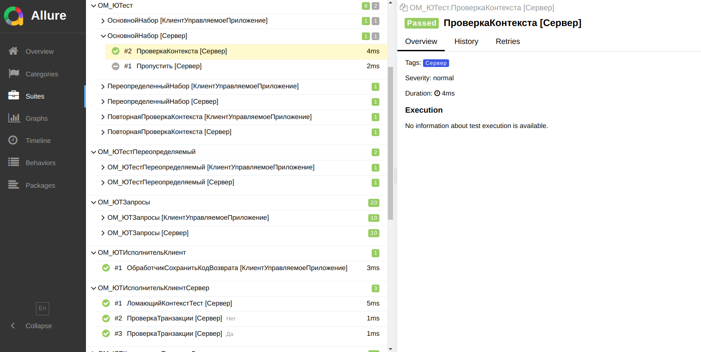

# Отчеты о тестировании

Важным этапом тестирования является формирование удобного и информативного отчета. YAxUnit предоставляет возможность работать с различными видами отчетов.

* Отчет в формате JUnit - используется при разработке тестов в EDT, позволяет быстро увидеть результат тестирования прямов в IDE, позволяет переходить по стеку ошибок и сравнивать фактическое и ожидаемое значение.
* Отчет в формате Allure - чаще всего применяется в CI, имеет богатую функциональность: фильтрация, различные группировки, история и статистика.
* Отчет в режиме 1С:Предприятия - удобен если вы не используете (или не можете использовать) по какой-либо причине EDT.

Указать необходимый формат вы может в [параметрах запуска](../getting-started/run/configuration), либо в [форме настроек](../yaxunit-ui#интерфейс-настройки-конфигурации).
По умолчанию используется формат `JUnit`.

## Формат `JUnit`

Широко распространенный формат отчетов о тестировании. Используется для интеграции с [плагином запуска тестов из EDT](https://github.com/bia-technologies/edt-test-runner). В отличии от Allure позволяет хранить и сравнивать ожидаемое и фактическое значения. Подходит для процесса разработки/отладки тестов.

## Формат `Allure`

Чаще применяется в CI как более универсальный и удобный способ организации отчетов о тестировании. Позволяет добавлять различную мета информацию, которая будет отображаться в отчете, имеет различные способы группировки, историю запусков и многое другое.

Группировка по тестовым наборам

Группировка по функциональности

