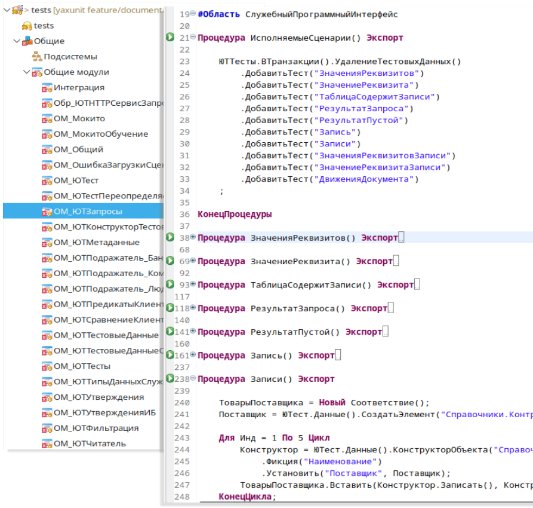

# Организация тестов

## Расширение с тестами

Тесты размещаются в расширениях конфигурации, вы можете их совместить с движком, либо создать отдельное расширение.

* Вместе с движком.
  * Доступна контекстная подсказка.
  * Сложнее обновлять движок, необходимо воспользоваться сравнением-объединением.
* В отдельном расширении.
  * Нет подсказки по методам движка.
  * Движок обновляется загрузкой/заменой.
  * Проще переключаться между версиями.
  * Движок можно не хранить в репозитории проекта.

Мы в своих проектах используем первый вариант, так как удобство и экономия времени каждым разработчиком от контекстной подсказки перевешивает минус ручного обновления.

## Тестовые модули

Тесты располагаются в общих модулях (не заимствованных).
Тестовые модули (наборы тестов объекта) состоят из следующих блоков:

* Метод регистрации тестов `ИсполняемыеСценарии`.
  В методе регистрации необходимо [перечислить все тесты](../features/test-registration.md) и, при необходимости, выполнить настройку.
* Реализация тестов, тестовые методы, собственно сами тесты.
* [Обработчики событий](../features/events.md), при необходимости.

Принято на один тестируемый модуль объекта создавать один общий модуль с тестами, например, тесты на модуль объекта и отдельно тесты на модуль менеджера.

Также полезно использовать регламент наименования тестовых модулей, так чтобы вам проще было с ними работать в будущем, облегчить навигацию.

Рекомендуем рассмотреть [схему нейминга](https://bia-technologies.github.io/edt-test-runner/dev/docs/%D0%A1%D1%85%D0%B5%D0%BC%D0%B0%20%D0%BD%D0%B0%D0%B8%D0%BC%D0%B5%D0%BD%D0%BE%D0%B2%D0%B0%D0%BD%D0%B8%D1%8F) с префиксами для типа объекта и суффиксами для типа модуля. Она поддерживается в [плагине](https://github.com/bia-technologies/edt-test-runner) для EDT и если ее соблюдать, вы сможете с легкостью переключатся между тестом и тестируемым методом.

## Тестовые методы

Тест состоит из двух обязательных частей:

* Регистрация в методе `ИсполняемыеСценарии`
* Реализация теста.
